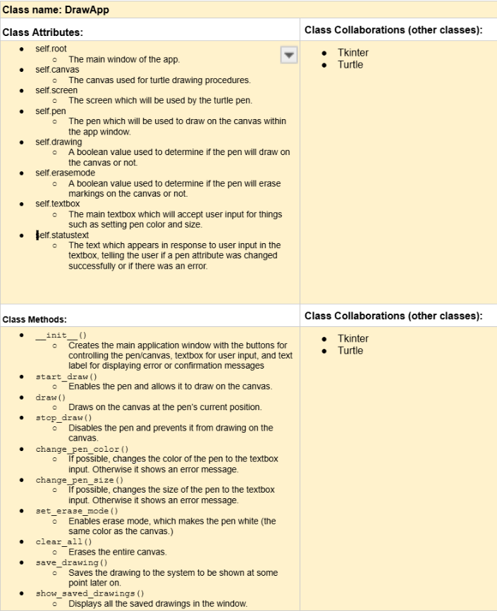

# CSC226 Final Project

## Instructions

❗️Exclamation Marks ❗️indicate action items; you should remove these emoji as you complete/update the items which 
  they accompany. (This means that your final README should have no ❗️in it!)

**Author(s)**: Abdou Diop, Dumisani Chikomo, Dee Munsaka

**Google Doc Link**: https://docs.google.com/document/d/1J8IbxmGM4bGjn1trPeETJC5O5yDZor9MMm0ymTe-xbs/edit?tab=t.0#heading=h.7bfm2pj5kkik

---

## Milestone 1: Setup, Planning, Design

**Title**: `Turtle Drawing App`

**Purpose**: `Allowing users to draw on their screen using Turtles and choose colors using
buttons on the screen.`

**Source Assignment(s)**: `HW02`

**CRC Card(s)**:
  - Create a CRC card for each class that your project will implement.
  - See this link for a sample CRC card and a template to use for your own cards (you will have to make a copy to edit):
    [CRC Card Example](https://docs.google.com/document/d/1JE_3Qmytk_JGztRqkPXWACJwciPH61VCx3idIlBCVFY/edit?usp=sharing)
  - Tables in markdown are not easy, so we suggest saving your CRC card as an image and including the image(s) in the 
    README. You can do this by saving an image in the repository and linking to it. See the sample CRC card below - 
    and REPLACE it with your own:



**Branches**: This project will **require** effective use of git. 

Each partner should create a branch at the beginning of the project, and stay on this branch (or branches of their 
branch) as they work. When you need to bring each others branches together, do so by merging each other's branches 
into your own, following the process we've discussed in previous assignments, then re-branching out from the merged code.  

```
    Branch 1 starting name: diopa
    Branch 2 starting name: munsakad
    Branch 3 starting name: chikomod
```

### References 

Throughout this project, you will likely use outside resources. Reference all ideas which are not your own, 
and describe how you integrated the ideas or code into your program. This includes online sources, people who have 
helped you, AI tools you've used, and any other resources that are not solely your own contribution. Update this 
section as you go. DO NOT forget about it!

---

## Milestone 2: Code Setup and Issue Queue

Most importantly, keep your issue queue up to date, and focus on your code. 🙃

Reflect on what you’ve done so far. How’s it going? Are you feeling behind/ahead? What are you worried about? 
What has surprised you so far? Describe your general feelings. Be honest with yourself; this section is for you, not me.

```
 we think that we are ahead so far because we have the snapshot of our project already
```

---

## Milestone 3: Virtual Check-In

Indicate what percentage of the project you have left to complete and how confident you feel. 

**Completion Percentage**: `80%`

**Confidence**: Describe how confident you feel about completing this project, and why. Then, describe some 
  strategies you can employ to increase the likelihood that you'll be successful in completing this project 
  before the deadline.

```
    We very confident about our project and we should be able to meet the deadline. 
```

---

## Milestone 4: Final Code, Presentation, Demo

### User Instructions

After hitting the "Run" button in PyCharm, the DrawingApp window will appear, where you can start drawing immediately. 
To draw, click and hold the left mouse button on the canvas, and move your mouse to create your drawing. You can change 
the pen color by typing a valid color name (e.g., "red", "blue") into the textbox and clicking the "Change Pen Color" 
button. Similarly, adjust the pen size by entering a number in the textbox and clicking the "Change Pen Size" button. 
To erase your drawing, click the "Erase" button, which will turn the pen color to white. If you need to clear the canvas 
entirely, simply click the "Clear All" button. To save your drawing, click the "Save" button, and the image will be 
saved in a folder named "saved_drawings" in your project directory. You can view saved drawings by clicking the "Saved 
Drawings" button, which opens a new window where you can see all saved images. Additionally, if you want to delete all 
saved drawings, you can click the "Delete All Saved Drawings" button in the saved drawings window.

### Errors and Constraints

Every program has bugs or features that had to be scrapped for time. These bugs should be tracked in the issue queue. 
You should already have a few items in here from the prior weeks. Create a new issue for any undocumented errors and 
deficiencies that remain in your code. Bugs found that aren't acknowledged in the queue will be penalized.

bug 1: One issue with the saving is that it does not take the screenshot properly and shows outside the window a little 
bit, especially if you move the window around the screen it will be off center.

### ❗Peer Evaluation

In our team, we collaborated effectively to complete the project and each member contributed their fair share. Throughout 
the development process, we divided the tasks efficiently and regularly communicated to ensure the features were 
integrated smoothly. Each team member took responsibility for specific sections of the code, and we frequently reviewed 
and tested each other’s work to ensure high quality and consistency.

Our Git commit history clearly reflects our contributions, with each member making regular commits to track progress. 
We followed good practices by creating meaningful commit messages and resolving any issues that came up during development. 
Everyone stayed engaged with the project, and all tasks were completed on time.

If there had been any member who didn't contribute fairly or failed to meet their responsibilities, we would have flagged 
it during our team discussions, but that was not the case. We worked well together, and I believe all members made 
valuable contributions to the success of this project.

### ❗Reflection

Each partner should write three to four well-written paragraphs address the following (at a minimum):
- Why did you select the project that you did?
- How closely did your final project reflect your initial design?
- What did you learn from this process?
- What was the hardest part of the final project?
- What would you do differently next time, knowing what you know now?
- How well did you work with your partner? What made it go well? What made it challenging?

```
    Partner 1: We selected the drawing application project because we wanted to intergrate graphical user interfaces (GUIs) 
    and programming.It allowed us to combine Python with Tkinter and Turtle, which was a great opportunity to apply 
    event-driven programming.Additionally, We wanted to build something interactive that could immediately showcase 
    the effects of the code, such as drawing on the screen and changing pen properties.
    
    The final project reflected the initial design but with a few additions. While I started with the idea of a basic 
    drawing app, We decided to include extra features, such as buttons for changing pen color, size, and saving drawings. 
    These improvements added more interactivity and complexity, enhancing the user experience without changing the core 
    design.
    
    This process taught me a lot about GUI development, especially working with Tkinter and handling mouse events. I also
    learned how to implement dynamic features like changing pen color and size and adding an erase mode. Capturing the 
    entire window as an image to save drawings was another valuable skill I gained, along with handling user errors 
    like invalid input.
     
     The hardest part was coordinating the buttons to function properly with the drawing tools was particularly challenging.
     Debugging these interactions took time and effort to make everything work smoothly.
     
     Next time, I would focus on organizing the code better by breaking it into more modular functions. This would make 
     it easier to modify and scale the app in the future. Additionally, I would make the UI more user-friendly with icons
     or visual cues to improve the overall user experience, especially for beginners.
      
      I worked well with my partners, dividing tasks based on our strengths. The challenge was syncing our parts together, 
      especially with the buttons and interactions, but clear communication helped us align our work and overcome these 
      challenges.
```

```
    Partner 2: **Replace this text with your reflection
```

---